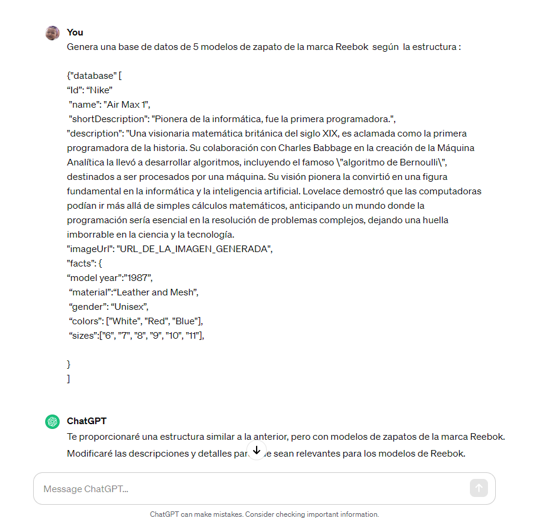
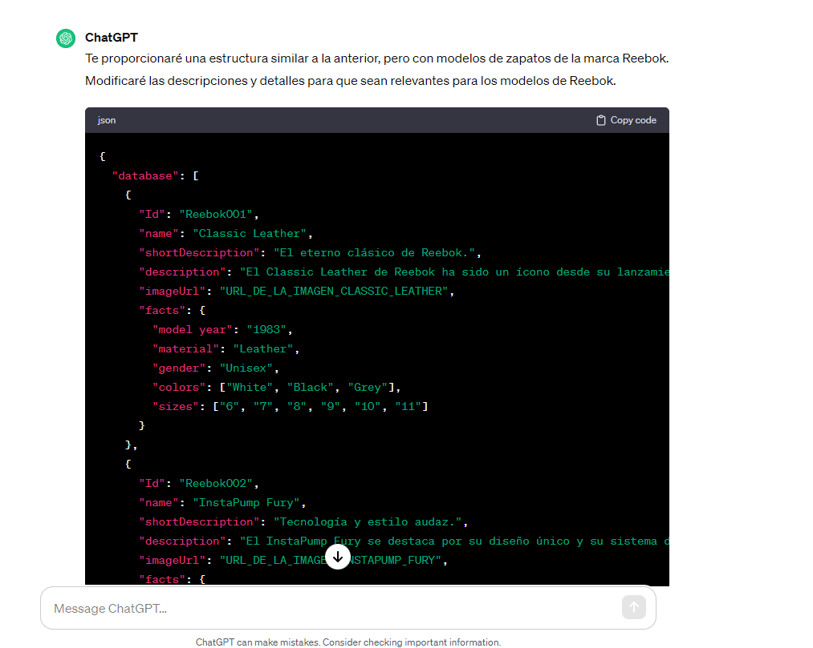
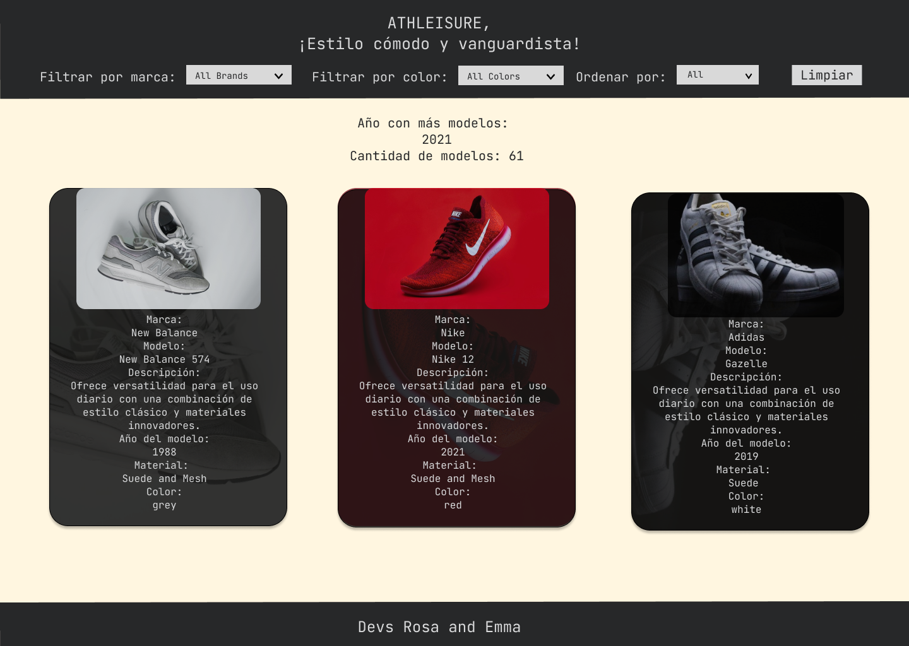
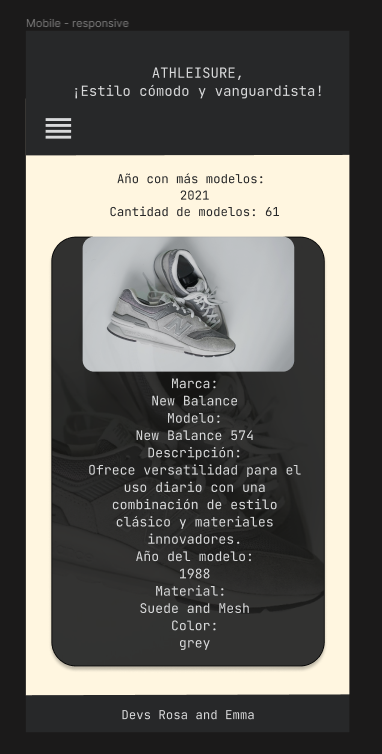

# Dataverse

## Preámbulo

Bienvenido al repositorio de la página web dedicada a mostrar una selección única de zapatillas de marcas reconocidas, destacando el estilo street leisure. Nuestro objetivo principal es proporcionar a los visitantes una experiencia visualmente atractiva y fácil de navegar, presentando una cuidadosa curaduría de calzado que encapsula la esencia del estilo urbano y relajado.
***

## Características Principales:

### Diversidad de Marcas Reconocidas: 
Ofrecemos una amplia gama de zapatillas de marcas renombradas, asegurando calidad y autenticidad en cada par.

### Enfoque en Street Leisure: 
Cada selección de zapatillas refleja la fusión perfecta entre la moda urbana y la comodidad casual, permitiendo a los usuarios adoptar un estilo de vida versátil.

### Interfaz Intuitiva: 
Nuestra página web se ha diseñado pensando en la facilidad de uso. La interfaz intuitiva permite a los usuarios explorar y descubrir diferentes estilos de zapatillas de manera eficiente.

### Información Detallada: 
Proporcionamos descripciones detalladas de cada par, incluyendo características clave, materiales y detalles de diseño, para que los usuarios puedan tomar decisiones informadas.

### Actualizaciones Frecuentes: 
Nos comprometemos a mantener nuestra colección actualizada con las últimas tendencias y lanzamientos de las marcas más populares, asegurando que los amantes del street leisure siempre encuentren opciones frescas.

### Comunidad Activa: 
Fomentamos la participación de la comunidad a través de comentarios y reseñas, creando un espacio interactivo donde los usuarios pueden compartir sus experiencias y recomendaciones.

# Creación de la data mediante uso de IA

El proyecto también incluye una parte muy escencial para el futuro del desarrollo de páginas web mediante la introducción de **Inteligencias Artificiales** que nos ayudaron a crear la base de datos con la cual estaríamos trabajando mediante el **prompting**. 

Un ejemplo de las directrices entregadas a la IA de ChatGPT fue la siguiente: 

Se le dio una serie de instrucciones teniendo en cuenta la estructura que queríamos que tuviera la base de datos. Era un arreglo de ojetos con diferentes valores, que adicionalmente, tendría otro objeto con más parámetros dentro. Al ver que no nos dio toda la data solicitada, pasamos a pedirle que nos diera 16 elementos adicionales.

La data que nos pasó la IA quedó dispuesta de esta manera: 

***

## Acá te mostramos como usarla

### Explorando la Colección: 
Al acceder a la página, serás recibido con una vista general de nuestra selección de zapatillas. Desplázate hacia abajo para explorar la diversidad de marcas y estilos disponibles.

### Filtros: 
Facilitamos la búsqueda con potentes filtros:

   -Color: Utiliza el filtro de color para encontrar zapatillas que se adapten a tu estilo o preferencia.
   -Marca: Filtra las opciones según tus marcas favoritas para una experiencia de compra más personalizada.

### Ordenamiento: 
Personaliza tu experiencia de visualización con las opciones de ordenamiento. Organiza la colección alfabéticamente por modelo para una búsqueda rápida y eficiente.

### Filtrado Avanzado: 
Combina varios filtros para refinar tu búsqueda. ¿Buscas zapatillas rojas de una marca específica? ¡Utiliza los filtros de color y marca simultáneamente!

### Interfaz Responsive: 
Nuestra página web se adapta a diferentes dispositivos, desde computadoras de escritorio hasta dispositivos móviles. Disfruta de la misma experiencia visualmente atractiva sin importar el dispositivo que utilices.

### Sin Instalación de Dependencias:
No es necesario instalar ninguna aplicación o dependencia para utilizar la página. Simplemente accede a través de tu navegador web favorito y comienza a explorar.

***
# Te contamos sobre el proceso de construcción

## Historias de usuario

Para garantizar un desarrollo eficiente y centrado en las necesidades de nuestros usuarios, hemos incorporado los principios y prácticas de la metodología ágil Scrum en el ciclo de vida de nuestro proyecto, estableciendo las siguientes UH.

*Como usuario quiero  poder ver los modelos  de zapatos pertenecientes al estilo Altheisure en forma de tarjetas.*

*Como usuario quiero poder filtrar los modelos de la marca de zapatos por medio de un desplegable.*

*Como usuario quiero poder filtrar los  zapatos teniendo en cuenta su color  por medio de un desplegable.*

*Como usuario quiero filtrar y ordenar la información de los zapatos de forma simultánea para tener una vista de los modelos y colores que quiero.*

*Como usuario quiero tener un contador que indique cuantos modelos están en pantalla.*

*Como usuario quiero poder tener un desplegable que me permita ordenar  los modelos de la marca de zapatos de forma ascendente y descendente.*

*Como usuario registrado quiero tener una página responsive para poder interactuar desde cualquier dispositivo.*

*Como usuario registrado quiero tener un botón que me permita restablecer la información sin actualizar la página.*

***

## Diseño de la página

Para el diseño, nos enfocamos en trabajar con un modelo de baja fidelidad el cual se fue construyendo con un esquema inicial que fue modificado al pedir feedback a nuestras compañeras.

En el diseño de alta fidelidad, se utilizaron colores en tendencia que transmitan una visión clara de los elementos.

***

## Problemas detectados en tests de usabilidad

Para una experiencia aún más intuitiva, debemos incorporar retroalimentación visual, como cambios de color y resaltado, para indicar claramente los elementos seleccionados.
Con estas consideraciones, esperamos que la experiencia de filtrado sea transparente y que puedas disfrutar de la exploración de nuestra colección de zapatillas Street Leisure de manera sencilla y personalizada (muy pronto verás estos ajustes).

¡Apreciamos tu retroalimentación continua para mejorar constantemente!
***
